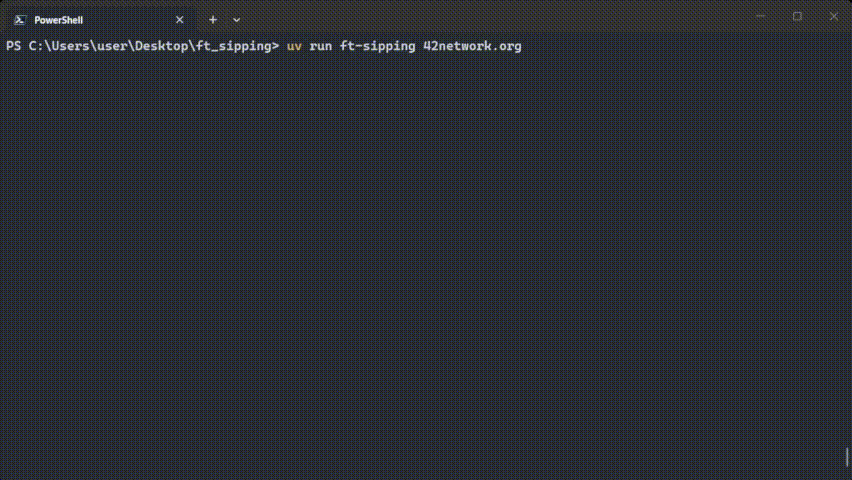

# ft_sipping

An animated `ping` tool that plays an anime sipping GIF while waiting for each reply, then clinks cups when a response arrives.



## Features

- True-color (24-bit ANSI) half-block GIF rendering in the terminal
- Single animation area reused across all pings — log lines accumulate below
- Transient status updates live during each animation phase
- Cross-platform: Windows, Linux, macOS / WSL

## Installation

Requires Python ≥ 3.11.

```bash
# With uv
uv tool install .

# Or with pip
pip install .
```

## Usage

```
ft-sipping <host> [options]
```

| Option | Default | Description |
|---|---|---|
| `-c COUNT` | `4` | Number of sip-pings |
| `-i INTERVAL` | `1.0` | Seconds between pings |
| `--width WIDTH` | `18` | Animation width in characters |

## Examples

```bash
ft-sipping 42network.org
ft-sipping 8.8.8.8 -c 10 -i 0.5
ft-sipping google.com --width 24
```

